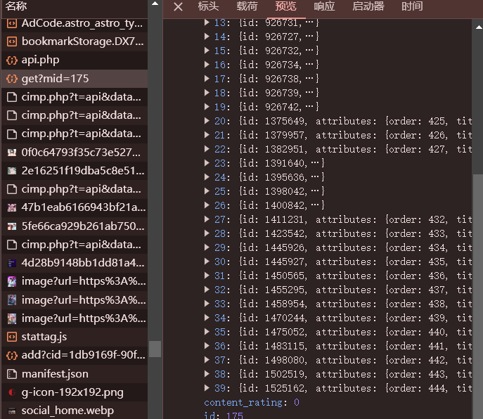

# comic-cangqiong

## 斗破苍穹和新版的镇魂街漫画爬虫

​	利用python异步协程，爬取斗破苍穹漫画，截至410话怨灵

​	使用的技术有异步请求，异步持久化存储，（异步文件存储）,爬虫基本图片存储

​	有线程池+异步协程加快下载的想法,但没有验证是否可行

## Dependencies

Python   3.7
asyncio  1.5.5 
aiohttp  3.8.3 
aiofiles 22.1.0 
loguru   0.6.0 

## Download

​	You can download my download comic pictures from [Baidu Netdisk](https://pan.baidu.com/s/1_EwKlxNtsRTYa2YMhKEAuw?pwd=dpcq) (Code: dpcq).

## 声明
​	本项目仅供学习使用，为练习python异步协程爬虫，该网站漫画以图片形式存储在网页源代码中，适合初级入门学者爬取，故作为练手，不得作为商业化使用。

## 新版镇魂街漫画提取流程（2024.6.19）
​	网页源码和之前不一样了，多了小广告，并且图片的链接并没有章节放在网页源码中，需要自己到开发者工具中搜索，利用好search工具。
​	首先打开某一章节的调试工具，发现图片的数据都存在json数据里面。请求的载荷主要是mid和一个c。点击查看这个json数据，发现mid是漫画的编号，而c是章节的id号。

   

   

​	再打开一个章节验证一下。
   

​	接下来就是拿到每个章节的id号，就可以批量提取了。再search中可以搜索上一个id的数字，然后点击每一个搜索出来的结果，发现下图对应的json数据中有想要的内容。
   

   

​	但是以上仅展示部分页面，直接展开整个目录，继续寻找含有get的请求接口，发现最终的api以及数据内容，这下可以美美地拿到数据并开心爬取了。
   

   